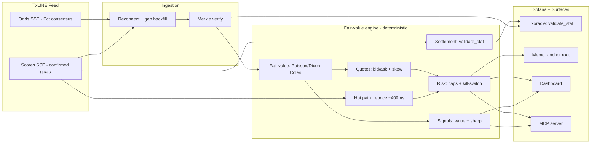
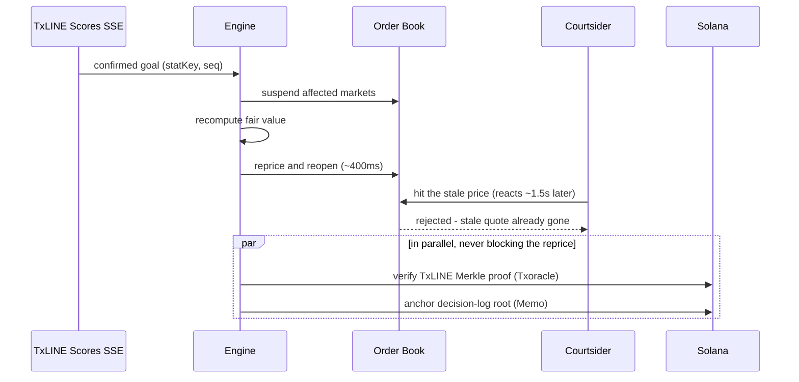

<p align="center">
  
</p>

<h1 align="center">Catenaccio</h1>

<p align="center">
  An autonomous in-play football market-making agent. It ingests TxLINE's live odds
  and scores, reprices in about 400&nbsp;ms when a goal is confirmed so a book is not
  picked off by latency arbitrage, and anchors every price on Solana.
</p>

<p align="center">
  
  
  
  
  
</p>

<p align="center">
  <b>Submitted to: Trading Tools &amp; Agents.</b> TxODDS &times; Solana World Cup Hackathon.
</p>

---

## What it is

Catenaccio is a market maker for live football betting markets. It quotes two-sided
prices on World Cup in-play markets (match result, over/under 2.5 goals, both teams to
score), reads TxLINE's live odds and scores feeds, and reprices when the match state
changes. When a goal or card is confirmed it suspends the affected markets, recomputes
fair value, and reopens — in about 400&nbsp;ms.

The edge is operational, not predictive. The agent earns the bid/ask spread and avoids
being traded against on a stale price. It does not claim to forecast results better than
the market; it anchors to the market's own consensus and only moves when the score or
clock moves.

## How the pieces fit, and why each one exists

Everything hangs off **one fair-value engine**. That engine is the spine; every other
part of the system either feeds it authentic data or consumes its output. Nothing here
is a bolt-on — each piece is the answer to a specific problem a real desk has.

| Component | Exists because | What it does |
|---|---|---|
| **Live TxLINE ingestion** | The engine is only as good as its inputs, and a stale or forged input is exactly what gets a book picked off | Streams the odds + scores SSE, reconnects, detects sequence gaps, and backfills before resuming |
| **Fair-value engine** | You cannot quote, signal, or settle without a number you trust | Time-decaying Poisson / Dixon-Coles, calibrated to the de-margined consensus |
| **Quotes** | The core job: make a two-sided market and earn the spread | Bid/ask per outcome with inventory skew and a cross-market consistency guard |
| **~400 ms hot path** | A goal moves the true price seconds before a slow book updates; that gap is where the book loses money | Suspend → reprice → reopen on a confirmed event, before a courtsider can act |
| **Signals** | The same model that prices the book also measures where it disagrees with the market — that disagreement is a tradeable signal | Surfaces model-vs-market value, sharp consensus moves, and live win probability |
| **Risk rails** | An autonomous agent that can blow up is not deployable | Exposure caps, drawdown kill-switch, fees, and suspend-on-gap |
| **Settlement** | A position has to be closed out, and resolving it against the authoritative proof is what makes the P&L credible instead of asserted | Resolves each of the agent's own markets against the Merkle-proven score via Txoracle `validate_stat` |
| **On-chain anchoring + verification** | A track record nobody can audit is worth little | Anchors the decision-log root and lets anyone verify any fill against its TxLINE proof |
| **MCP server** | Other agents should be able to consume these signals | Exposes fair value, quotes, signals, the arb report, and settlement as callable tools |

Read top to bottom it is one loop: **authentic data in → fair value → quote, signal, and
manage risk → settle and prove.**

## The problem it solves

When a goal is scored the fair price changes immediately, but many books take several
seconds to update. In that window, someone who sees the goal first can back the outcome
at the old price for near-risk-free profit. This is latency arbitrage, or courtsiding.
Today only the largest operators react fast enough to avoid it.

Example: a match is 1&ndash;1 and the away side scores in the 84th minute. "Away win"
should shorten from about 3.0 to about 1.3 straight away. A book on a slow feed still
shows 3.0 for a few seconds; a courtsider backs it and profits. Catenaccio suspends and
reprices before that trade can land. Across 500 simulated matches a broadcast-derived
book leaks roughly $640 of this per match; Catenaccio leaks roughly $0.

## How it works

<p align="center">
  
</p>



The model. Remaining goals are modelled as a time-decaying Poisson process with a
Dixon-Coles low-score correction. At kickoff the scoring rates are calibrated to TxLINE's
de-margined consensus (`Pct`), so the agent starts where the market is. After that the
fair value moves only because the score, clock, or cards moved. On a confirmed goal the
model updates instantly while the market consensus lags by its feed latency; the agent
reprices into that lag rather than trying to out-predict anyone.

The hot path, on a confirmed goal:



## Live TxLINE integration

TxLINE is the **primary data source**. The agent consumes two SSE streams — odds
(`Pct` de-margined consensus) and scores (sub-second confirmed goals and cards) — through
a resilient client that reconnects, detects `seq` gaps, and backfills the missed interval
before it resumes quoting. The engine never quotes on stale data.

```bash
# deterministic demo, no credentials needed
npm run agent

# live: stream the real TxLINE odds + scores feed into the same engine
TXLINE_JWT=... TXLINE_API_TOKEN=... npm run live
```

The same engine runs in both modes — the only difference is whether events come from the
bundled replay or the live socket. Auth is TxLINE's two-token flow (guest JWT + an API
token activated after a free on-chain subscription); see `.env.example`.

## Signals

The fair-value engine does double duty. The number it uses to quote is also a prediction,
and where it diverges from the market is a signal:

- **Value** — outcomes the model rates differently from the de-margined consensus, in
  percentage points (e.g. "Draw underpriced by 4.1pp").
- **Sharp** — fast moves in the consensus itself, tick over tick.
- **Live win probability** — the model's current 1X2 read.

These are the agent's signal-detection output: the thing a human trader or another bot
would act on. They are shown live on the dashboard and exposed over MCP (`get_signals`).

## Settlement

At full time the agent has to close out its own positions. Rather than grade them itself,
it resolves each market against TxLINE's Merkle-proven final score through Txoracle's
`validate_stat`, which evaluates a parametric predicate against the signed scores and
returns a result — so the settled P&L is verifiable, not asserted. Each market maps to a
concrete predicate:

| Market | Winning-outcome predicate (as `validate_stat` evaluates it) |
|---|---|
| Match result (home) | `homeGoals - awayGoals > 0` |
| Over/Under 2.5 (over) | `homeGoals + awayGoals > 2` |
| Both teams to score (yes) | `homeGoals ≥ 1 AND awayGoals ≥ 1` |

This is the agent settling **its own book** against the authoritative proof — no user
funds, no escrow, no counterparties. It is the last step of the trading loop, made
auditable. (`get_settlement` exposes the same over MCP.)

## On-chain layer, and how much Rust

Two things touch Solana. Neither requires a custom smart contract.

1. Verifying TxLINE data and resolving outcomes: TxODDS already deployed the `Txoracle`
   program, with `validate_stat`. We call it from a TypeScript client. No Rust written by us.
2. Anchoring the decision log: a 32-byte Merkle root of the agent's decisions is written
   via the SPL Memo program. No Rust written by us.

So the live system is TypeScript end to end. An optional ~50-line Anchor program lives in
[`onchain/`](onchain/) for teams who want a dedicated account instead of memos; the app,
the demo, and the verification all run without deploying it.

A proof confirms the data behind a price or settlement is authentic and unaltered. It does
not claim a decision was optimal. The wording throughout is "tamper-evident and
independently verifiable", not "trustless".

## How it maps to the judging criteria

| Criterion | Where it shows up |
|---|---|
| Core functionality and data ingestion | Quotes are decisions off the live/replayed TxLINE odds and scores SSE; reconnect and gap backfill; `npm run live` |
| Autonomous operation | A closed loop with no manual input — ingest, price, quote, manage risk, settle |
| Logic and code architecture | Deterministic, event-sourced, documented, 31 tests; a model calibrated to consensus |
| Innovation and novelty | On-chain-verifiable quotes plus a ~400 ms verified-event reprice, with signals exposed over MCP |
| Production readiness | Exposure caps, kill-switch, suspend-on-gap, real fees, a backtest, verifiable settlement, and a working dashboard |

## Tech stack

| Layer | Technology | Purpose |
|---|---|---|
| Agent core | TypeScript, no runtime deps | Deterministic event-sourced engine; runs in the browser and in Node |
| Model | Poisson / Dixon-Coles | In-play fair value, calibrated to TxLINE consensus |
| Web | Next.js 15 (App Router), React 19 | Landing page and live dashboard |
| UI | Tailwind CSS, Framer Motion | Light theme |
| Data | TxLINE SSE (odds + scores) | Live, granular match data |
| On-chain | @solana/web3.js, SPL Memo, TxODDS Txoracle | Verify data, resolve outcomes, anchor the audit trail |
| Crypto | SHA-256 + Merkle tree (in-repo) | Inclusion proofs |
| Interop | Model Context Protocol server | Exposes the agent's signals to other agents |
| Tests | Vitest | Math, determinism, defence logic, settlement |

## Quickstart

Everything runs with no credentials, on a deterministic replay with simulated on-chain
anchoring (the Merkle verification itself is real). To go live, copy `.env.example` to
`.env` and add a TxLINE token and a Solana devnet wallet.

```bash
npm install
npm run dev        # landing page at :3000; "Launch app" opens the dashboard at /app
npm run agent      # headless run of the same engine
npm run live       # stream the real TxLINE feed (needs TXLINE_JWT + TXLINE_API_TOKEN)
npm run backtest   # 500 simulated matches
npm run sweep      # latency-arb sensitivity curve
npm run mcp        # MCP server over stdio
npm test           # 31 tests
```

Backtest over 500 simulated matches (reproduce with `npm run backtest`):

```
mean P&L / match      $2,629        profitable matches    99%
Sharpe (per match)    3.16          worst / best match    -$1,132 / $4,233
mean commission/match $668          mean arb prevented    $639 / match
mean reprice latency  410 ms
```

A market maker can lose on any single match; the value is the mean over many, plus the
latency-arb it avoids. There is no claim of guaranteed profit.

## MCP tools

The server exposes the agent over stdio so another agent can call it:
`get_fair_value`, `get_quote`, `get_signals`, `get_arb_report`, `verify_decision`,
`run_backtest`, `get_settlement`.

## Tests

```bash
npm test
```

| Suite | Covers |
|---|---|
| `crypto` | SHA-256 against NIST vectors; Merkle proofs verify; tampering is detected |
| `model` | Calibration to consensus; a goal raises P(win); draw rises with time; red-card effect |
| `courtsiding` | Leak is zero when the reprice beats the attacker; a slow defender leaks |
| `engine` | Determinism (same seed → same Merkle root and P&L); reprice fires; bounded exposure; clean settlement |
| `settlement` | Predicate mapping per outcome; correct winners; receipts reference Txoracle and the proof; signals fire and stay quiet when model and market agree |

## Devnet addresses

| Program / token | Address |
|---|---|
| TxODDS Txoracle (verify + resolve) | [`6pW64gN1s2uqjHkn1unFeEjAwJkPGHoppGvS715wyP2J`](https://explorer.solana.com/address/6pW64gN1s2uqjHkn1unFeEjAwJkPGHoppGvS715wyP2J?cluster=devnet) |
| SPL Memo (decision-log anchoring) | [`MemoSq4gqABAXKb96qnH8TysNcWxMyWCqXgDLGmfcHr`](https://explorer.solana.com/address/MemoSq4gqABAXKb96qnH8TysNcWxMyWCqXgDLGmfcHr?cluster=devnet) |
| TxL mint (devnet) | [`4Zao8ocPhmMgq7PdsYWyxvqySMGx7xb9cMftPMkEokRG`](https://explorer.solana.com/address/4Zao8ocPhmMgq7PdsYWyxvqySMGx7xb9cMftPMkEokRG?cluster=devnet) |

## TxLINE endpoints used

| Endpoint | Used for |
|---|---|
| `POST /auth/guest/start` | guest JWT |
| `POST /api/token/activate` | activate the API token after an on-chain subscription |
| `GET /api/odds/stream` | de-margined consensus (`Pct`), the fair-value anchor |
| `GET /api/scores/stream` | sub-second confirmed goals and cards |
| `GET /api/{odds,scores}/updates/{day}/{hour}/{interval}` | replay and sequence-gap backfill |
| `GET /api/scores/stat-validation` | a stat and its Merkle proof |
| `Txoracle` `validate_stat` | confirm a stat / resolve an outcome against the on-chain root |

## API feedback

What worked: one normalised JSON schema across markets, real-time SSE for both odds and
scores, and a de-margined `Pct` consensus that is a good fair-value anchor. That every
datum is Merkle-verifiable on-chain made both the audit trail and settlement
straightforward — `validate_stat` maps cleanly onto market outcomes.

Friction: the docs resolve on `txline-docs.txodds.com`, which differs from the link in the
listing; the devnet base URL could be called out more clearly; and a documented SSE
reconnect and sequence-gap contract would save integrators from reimplementing it.

## Project structure

```
lib/engine/     deterministic agent (pure TypeScript)
  math/         SHA-256, in-play model
  merkle.ts     Merkle tree and inclusion proofs
  quote.ts      two-sided quoting + cross-market consistency guard
  signals.ts    value + sharp prediction signals
  risk.ts       exposure caps, kill-switch, fees
  courtsiding.ts  the calibrated latency-arb attacker
  engine.ts     event-sourced orchestrator
  replay.ts     scripted demo match; simulate.ts generates random matches
lib/txline/     auth, resilient SSE client, payload normaliser
lib/onchain/    Memo anchoring (solana.ts) and validate_stat settlement (settlement.ts)
components/     dashboard, landing page, illustration, logo
mcp/            MCP server
scripts/        agent, live, backtest, sweep
tests/          Vitest suites
onchain/        optional Anchor program and notes
```

## Limitations

- Single-match P&L varies; a market maker sometimes lays the eventual winner. The mean
  over many matches is positive (see the backtest). No guaranteed profit.
- There is no real counterparty in a hackathon, so order flow and the courtsider are
  simulated. The attacker is calibrated and the result is a sensitivity curve rather than
  a single figure.
- A Merkle proof guarantees data authenticity, not decision quality. Settlement here
  resolves the agent's own positions; it is not a user-facing escrow.
