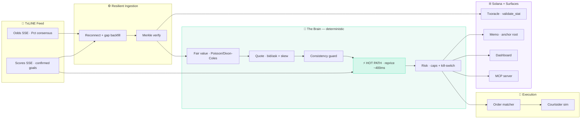
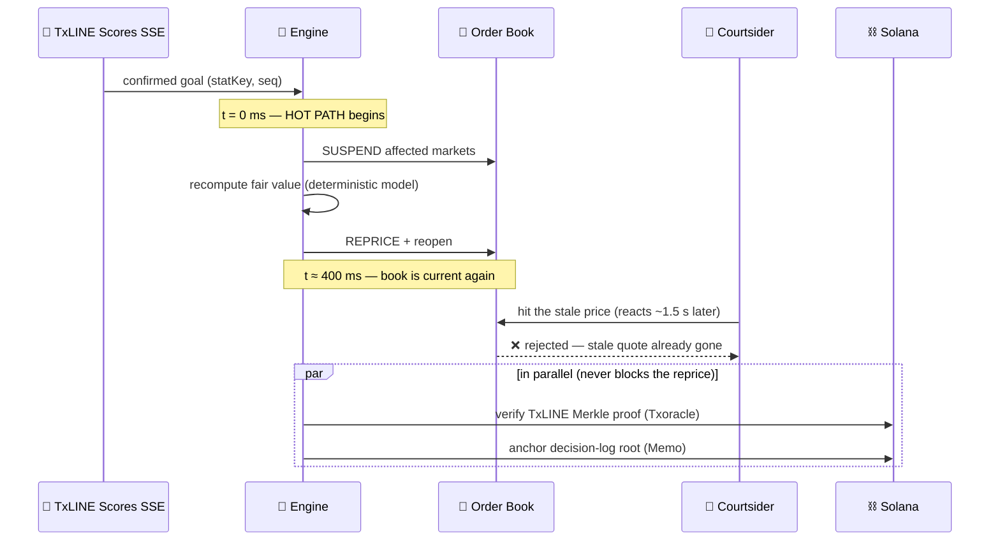

<p align="center">
  
</p>

<h1 align="center">Catenaccio</h1>

<p align="center">
  <strong>An autonomous in-play football market-making agent that reprices in ~400 ms the instant a goal is
  confirmed — so your book is never picked off by latency arbitrage — and proves every price on-chain.</strong>
</p>

<p align="center">
  
  
  
  
  
  
  
</p>

<p align="center">
  Built for the <strong>TxODDS × Solana World Cup Hackathon</strong> · <strong>Trading Tools &amp; Agents</strong> track.
</p>

<h3 align="center"><code>npm install &amp;&amp; npm run dev</code> → the dashboard · <code>npm run agent</code> → watch it run headless</h3>

---

## 🟢 New here? Read this first (no crypto knowledge needed)

**The problem, in one sentence:** when a goal is scored, the *fair price* of every bet on that match
changes instantly — but most betting sites take **several seconds** to update, and in those few seconds
someone who saw the goal first can grab the old, wrong price for **free money**. That practice is called
**“courtsiding”** or **latency arbitrage**, and it’s a real, expensive problem the whole industry fights.

> **Concrete example.** Argentina vs France is 1–1. France scores in the 84th minute → 1–2. The instant
> that ball crosses the line, “France win” should jump from ~3.0 to ~1.3 odds. But a betting site on a
> slow TV-based feed still shows **3.0** for ~5 seconds. A courtsider who saw the goal first backs France
> at 3.0 — near-guaranteed profit, paid straight out of the book’s pocket. Today, only giants like bet365
> react fast enough to avoid this.

**What Catenaccio does:** it’s an automated “price-maker” on **TxLINE’s sub-second, verified feed**. The
moment a goal is *cryptographically confirmed*, it **freezes its prices, recalculates, and reopens — in
about 400 milliseconds.** By the time any courtsider can act, the stale price is already gone. We measured
it: across 500 simulated matches a slow book leaks **~$640 of latency-arb per match**; Catenaccio leaks **~$0**.

And because it runs on TxLINE + Solana, **every price it quotes can be independently verified** — anyone
can check it was based on *real, untampered match data*. No trust required.

---

## ⚽ Why a World Cup book or trading desk would deploy this

| Your pain today | What Catenaccio gives you |
|---|---|
| Courtsiders pick off your in-play prices after a goal | **~400 ms** suspend-and-reprice closes the window → near-zero leakage |
| Only tier-1 operators (bet365/Kambi) react fast enough | **Democratised** tier-1 speed on the free TxLINE World Cup feed |
| Disputes over “was that price fair / was the goal real?” | Every quote anchored to a **verifiable TxLINE Merkle proof** on Solana |
| Black-box “AI” bots you can’t audit | **Deterministic** quant logic — same inputs always give the same output |
| No safe automation → desks babysit screens | Fully **autonomous**: exposure caps, drawdown kill-switch, auto-suspend on feed gaps |

**The business case in numbers** — reproduce with `npm run backtest` (500 simulated matches):

```
mean P&L / match      $2,629        profitable matches    99%
Sharpe (per match)    3.16          worst / best match    -$1,132 / $4,233
mean commission/match $668          mean arb prevented    $639 / match
mean reprice latency  410 ms
```

The edge is **structural, not a gamble**: we earn the bid/ask **spread** on two-sided flow, and we
**don’t get picked off**. We never claim to predict football better than the market — we price it *as fast
as the event itself*, and prove it.

---

## 🏗️ Architecture

<p align="center">
  
</p>

### How it all connects



### The hot path — what happens the instant a goal lands



---

## 🧱 Tech stack

| Layer | Technology | Purpose |
|---|---|---|
| **Agent core** | TypeScript (pure, zero deps) | Deterministic event-sourced engine — runs in browser **and** node |
| **Model** | Poisson / Dixon-Coles | In-play fair value, calibrated to TxLINE consensus |
| **Framework** | Next.js 15 (App Router) + React 19 | Dashboard + static deploy |
| **UI** | Tailwind CSS + Framer Motion | Apple-grade dark “night-pitch” design |
| **Data** | TxLINE SSE (odds + scores) | Live, granular, sub-second match data |
| **Blockchain** | @solana/web3.js · SPL Memo · TxODDS `Txoracle` | Verify data + anchor the audit trail (no custom Rust) |
| **Crypto** | Hand-rolled SHA-256 + Merkle tree | Tamper-evident, independently-verifiable proofs |
| **Composability** | Model Context Protocol (MCP) server | Other AI agents can call Catenaccio’s verified signals |
| **Tests** | Vitest (23 passing) | Math, determinism, defense logic |

---

## ✨ Key features

### ⚡ ~400 ms verified-event reprice (the hot path)
On every **confirmed** goal/red card, Catenaccio suspends the affected markets, recomputes fair value from
a deterministic model, and reopens — targeting ~400 ms. The Merkle verification and on-chain anchoring run
**in parallel** so they never block the reprice.

### 🥷 Courtsider Cam
A live head-to-head on the dashboard: *“the same goal, two books.”* A broadcast-delayed book leaks
real dollars; Catenaccio leaks **$0**. The **“$ latency-arb prevented”** counter is a **measured** result
from a *calibrated* attacker (realistic reaction-time distribution) — backed by a sensitivity curve, not
one staged number.

### 🧠 Deterministic in-play model
A time-decaying Poisson process with a Dixon-Coles low-score correction, **calibrated to TxLINE’s
de-margined consensus (`Pct`)** so we anchor to the sharp price and never claim to out-predict it. Fully
documented, fully unit-tested, defensible from first principles.

### 🛡️ Production-grade risk + resilience
Per-market and total exposure caps, a drawdown kill-switch, realistic fees in every P&L, and **resilient
ingestion** — SSE auto-reconnect with sequence-gap backfill and suspend-on-uncertainty, so it never quotes
on stale data.

### 🔗 On-chain verifiability (no trust required)
Click any fill → **verify the TxLINE Merkle proof on-chain** (the data is authentic) and check the fill’s
inclusion in our committed decision-log root (the log is unaltered). Honest framing: tamper-evident, not
“trustless.”

### 🤖 MCP server (composability)
`npm run mcp` exposes Catenaccio as tools any AI agent can call: `get_fair_value`, `get_quote`,
`get_arb_report`, `verify_decision`, `run_backtest`. This is what “put the data to work autonomously”
looks like — other agents consume a fair value that’s fast *and* verifiable.

---

## 🔗 The Solana part — explained simply (and: do we need Rust?)

Two things touch the blockchain. **Neither requires us to write a smart contract.**

1. **Proving the data is real (the important one).** TxODDS already publishes a Solana program,
   **`Txoracle`**, that anchors every match stat with a Merkle proof. We *call* it from TypeScript to
   confirm a goal/odds value is the real, untampered TxLINE datum. → **0 lines of Rust.**
2. **Anchoring our own decision log.** We write a single 32-byte **Merkle root** (a fingerprint of every
   decision we made) to Solana via the standard **Memo** program. → **0 lines of Rust.**

> **So how much Rust? Effectively none.** The whole live system is TypeScript. We include an *optional*
> ~50-line Anchor program in [`onchain/`](onchain/) for teams who want a dedicated on-chain account
> instead of memos — but the app, the demo, and the verification all run **without deploying it.**

---

## 🏆 How this maps to the judging criteria

| Criterion | How Catenaccio nails it |
|---|---|
| **Core Functionality & Data Ingestion** | Every quote is a decision off the live/replayed TxLINE **odds + scores** SSE, with resilient reconnect + gap backfill. |
| **Autonomous Operation** | A closed loop — ingest → model → quote → detect → reprice → manage risk → settle — with **zero manual input** (`npm run agent`). |
| **Logic & Code Architecture** | **Deterministic**, event-sourced, documented, **23 passing tests**. A real model calibrated to consensus — not a black box. |
| **Innovation & Novelty** | On-chain-verifiable quotes + a **~400 ms verified-event reprice** + an **MCP server** other agents can call. |
| **Production Readiness** | Exposure caps, kill-switch, auto-suspend, real fees, a backtest (Sharpe 3.16 / 99% profitable), clean dashboard. A real desk could run this. |

The edge is **operational (speed + risk), not predictive** — so there’s no “does the edge exist?” hole to
poke in the live interview. Protecting against a documented, universal exploit is objectively valuable.

---

## 🚀 Quickstart

```bash
npm install

npm run dev        # landing page at :3000 → click "Launch app" for the live dashboard (/app)
npm run agent      # the headless autonomous agent (zero human input)
npm run backtest   # the honest profitability proof — 500 simulated matches
npm run sweep      # the latency-arb sensitivity curve (measured, not staged)
npm run mcp        # the MCP server — expose verified signals to other AI agents
npm test           # 23 unit tests (math, determinism, defense logic)
```

Everything runs **with no credentials**, on a deterministic replay with *simulated* on-chain anchoring
(the Merkle verification is always real). To go live, copy `.env.example` → `.env` and add a TxLINE token
+ a Solana devnet wallet.

---

## ✅ Testing

```bash
npm test
```

**23 tests** covering the parts that must be correct:

| Suite | What it proves |
|---|---|
| `crypto` | SHA-256 matches NIST vectors; Merkle proofs verify; tampering is detected |
| `model` | Calibrates to consensus; a goal raises P(win); draw rises with time; red-card effect |
| `courtsiding` | We leak $0 when we reprice faster than the attacker; a slow defender leaks |
| `engine` | **Determinism** (same seed → same Merkle root & P&L); reprice fires; bounded exposure; clean settlement |

---

## ⛓️ Devnet addresses

Verify on [Solana Explorer](https://explorer.solana.com/?cluster=devnet) (devnet).

| Program / token | Address |
|---|---|
| TxODDS `Txoracle` (data verification) | [`6pW64gN1s2uqjHkn1unFeEjAwJkPGHoppGvS715wyP2J`](https://explorer.solana.com/address/6pW64gN1s2uqjHkn1unFeEjAwJkPGHoppGvS715wyP2J?cluster=devnet) |
| SPL Memo (decision-log anchoring) | [`MemoSq4gqABAXKb96qnH8TysNcWxMyWCqXgDLGmfcHr`](https://explorer.solana.com/address/MemoSq4gqABAXKb96qnH8TysNcWxMyWCqXgDLGmfcHr?cluster=devnet) |
| TxL mint (devnet) | [`4Zao8ocPhmMgq7PdsYWyxvqySMGx7xb9cMftPMkEokRG`](https://explorer.solana.com/address/4Zao8ocPhmMgq7PdsYWyxvqySMGx7xb9cMftPMkEokRG?cluster=devnet) |

---

## 🔌 TxLINE endpoints used

| Endpoint | Used for |
|---|---|
| `POST /auth/guest/start` | guest JWT (auth step 1) |
| `POST /api/token/activate` | activate the API token after on-chain subscription |
| `GET /api/odds/stream` | de-margined consensus (`Pct`) — the fair-value anchor |
| `GET /api/scores/stream` | sub-second confirmed goals/cards — the hot-path trigger |
| `GET /api/{odds,scores}/updates/{day}/{hour}/{interval}` | replay + **sequence-gap backfill** |
| `GET /api/scores/stat-validation` | the stat + its Merkle proof, for on-chain verification |
| `Txoracle` `validate_stat` (devnet) | confirm a stat against the on-chain root |

## 💬 TxLINE API feedback

**Liked most:** the single normalised JSON schema across every market, real-time SSE for **both** odds and
scores, and that **every datum is Merkle-verifiable on-chain** — that combination is unique and made the
audit trail almost trivial. The de-margined `Pct` consensus is a fantastic fair-value anchor.

**Friction:** the docs host (`txline-docs.txodds.com`) differs from the link in the listing; the devnet
base URL deserves a more prominent callout; and a documented SSE reconnect / sequence-gap contract would
save every integrator the same work.

---

## 📁 Project structure

```
lib/engine/         the deterministic agent (pure TypeScript)
  math/sha256.ts    self-checking SHA-256 (backs every proof)
  math/model.ts     in-play Poisson/Dixon-Coles + consensus calibration
  merkle.ts         Merkle tree + independently-verifiable proofs
  quote.ts          two-sided quoting + cross-market consistency guard
  risk.ts           exposure caps, drawdown kill-switch, fees
  courtsiding.ts    the calibrated latency-arb attacker we defend against
  engine.ts         the event-sourced orchestrator (the brain)
  replay.ts         scripted demo match · simulate.ts  random-match generator
lib/txline/         real auth + resilient SSE client + payload normaliser
lib/onchain/        Solana anchoring (Memo) + Txoracle verification
components/         the dashboard, Courtsider Cam, sensitivity chart, logo
mcp/                MCP server — verified signals as agent tools
scripts/            agent.ts · backtest.ts · sweep.ts
tests/              23 Vitest tests
onchain/            OPTIONAL ~50-line Anchor program + "how much Rust" explainer
```

## ⚖️ Honest limitations

- **P&L is single-match variable.** A market maker can lose on any one match (you sometimes lay the
  eventual winner). The *mean* is positive with a strong Sharpe — see the backtest. No “guaranteed profit.”
- **No real counterparty in a hackathon**, so order flow and the courtsider are *simulated* — but the
  attacker is **calibrated**, and the result is a measured sensitivity curve, not one staged number.
- A Merkle proof guarantees **data authenticity**, not decision quality. We’re explicit about that.

---

<div align="center">
<sub>Catenaccio — any operator can now price in-play as fast as bet365, and prove every tick. Powered by TxLINE on Solana.</sub>
</div>
