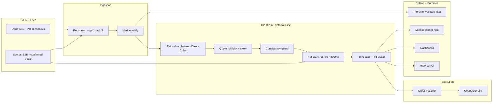
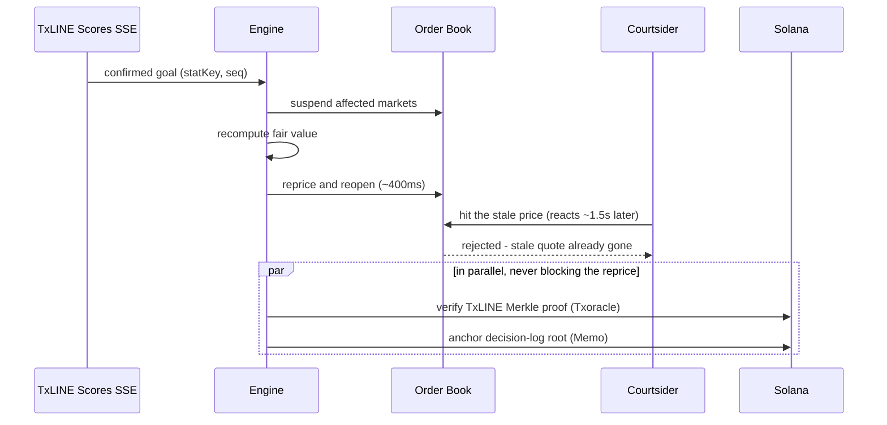

<p align="center">
  
</p>

<h1 align="center">Catenaccio</h1>

<p align="center">
  An autonomous in-play football market-making agent. It reprices in about 400&nbsp;ms when a goal is
  confirmed, so a book is not picked off by latency arbitrage, and it anchors every price on Solana.
</p>

<p align="center">
  
  
  
  
  
</p>

<p align="center">
  Built for the TxODDS &times; Solana World Cup Hackathon &middot; Trading Tools &amp; Agents track.
</p>

---

## What it is

Catenaccio is a market maker for live football betting markets. It quotes two-sided prices on World Cup
in-play markets (match result, over/under 2.5 goals, both teams to score), reads TxLINE's live odds and
scores feeds, and reprices when the match state changes. When a goal or card is confirmed it suspends the
affected markets, recomputes fair value, and reopens — in about 400&nbsp;ms.

The edge is operational, not predictive. The agent earns the bid/ask spread and avoids being traded
against on a stale price. It does not claim to forecast results better than the market; it anchors to the
market's own consensus and only moves when the score or clock moves.

## The problem

When a goal is scored the fair price changes immediately, but many books take several seconds to update.
In that window, someone who sees the goal first can back the outcome at the old price for near-risk-free
profit. This is called latency arbitrage, or courtsiding. Today only the largest operators react fast
enough to avoid it.

For example: a match is 1&ndash;1 and the away side scores in the 84th minute. "Away win" should shorten
from about 3.0 to about 1.3 straight away. A book on a slow feed still shows 3.0 for a few seconds; a
courtsider backs it and profits. Catenaccio suspends and reprices before that trade can land. Measured
across 500 simulated matches, a book on a broadcast-derived feed leaks roughly $640 of this per match;
Catenaccio leaks roughly $0.

## How it works

<p align="center">
  
</p>



The model. Remaining goals are modelled as a time-decaying Poisson process with a Dixon-Coles low-score
correction. At kickoff the scoring rates are calibrated to TxLINE's de-margined consensus (`Pct`), so the
agent starts where the market is. After that the fair value moves only because the score, clock, or cards
moved. On a confirmed goal the model updates instantly while the market consensus lags by its feed
latency; the agent reprices into that lag rather than trying to out-predict anyone.

The hot path, on a confirmed goal:



## On-chain layer, and how much Rust

Two things touch Solana. Neither requires a custom smart contract.

1. Verifying TxLINE data: TxODDS already deployed the `Txoracle` program, which anchors each match stat
   with a Merkle proof. We call its `validate_stat` from a TypeScript client. No Rust written by us.
2. Anchoring the decision log: we write a 32-byte Merkle root of the agent's decisions via the standard
   SPL Memo program. No Rust written by us.

So the live system is TypeScript end to end. An optional ~50-line Anchor program lives in
[`onchain/`](onchain/) for teams who want a dedicated on-chain account instead of memos; the app, the
demo, and the verification all run without deploying it.

A note on what the proof guarantees: it confirms the data behind a price is authentic and unaltered. It
does not claim a decision was optimal. The wording throughout is "tamper-evident and independently
verifiable", not "trustless".

## Tech stack

| Layer | Technology | Purpose |
|---|---|---|
| Agent core | TypeScript, no runtime deps | Deterministic event-sourced engine; runs in the browser and in Node |
| Model | Poisson / Dixon-Coles | In-play fair value, calibrated to TxLINE consensus |
| Web | Next.js 15 (App Router), React 19 | Landing page and live dashboard |
| UI | Tailwind CSS, Framer Motion | Light theme |
| Data | TxLINE SSE (odds + scores) | Live, granular match data |
| On-chain | @solana/web3.js, SPL Memo, TxODDS Txoracle | Verify data and anchor the audit trail |
| Crypto | SHA-256 + Merkle tree (in-repo) | Inclusion proofs |
| Interop | Model Context Protocol server | Exposes the agent's signals to other agents |
| Tests | Vitest | Math, determinism, defence logic |

## Features

- Reprice on a confirmed goal or card in about 400 ms; verification and anchoring run in parallel and
  never block the reprice.
- Side-by-side comparison on the dashboard ("Courtsider Cam"): a broadcast-delayed book versus Catenaccio,
  with the dollars leaked on each. The figure is a measured result from a calibrated attacker with a
  realistic reaction-time distribution, shown alongside a sensitivity curve.
- Deterministic in-play model (Poisson / Dixon-Coles), calibrated to consensus and unit-tested.
- Risk controls: per-market and total exposure caps, a drawdown kill-switch, realistic fees, and
  suspend-on-uncertainty when the feed gaps.
- Resilient ingestion: SSE reconnect with sequence-gap detection and backfill.
- Per-fill verification: resolve a fill to its TxLINE Merkle proof and check it against the on-chain root.
- MCP server exposing `get_fair_value`, `get_quote`, `get_arb_report`, `verify_decision`, `run_backtest`.

## How it maps to the judging criteria

| Criterion | Where it shows up |
|---|---|
| Core functionality and data ingestion | Quotes are decisions off the live/replayed TxLINE odds and scores SSE; reconnect and gap backfill |
| Autonomous operation | Closed loop with no manual input (`npm run agent`) |
| Logic and code architecture | Deterministic, event-sourced, documented, 23 tests; a model calibrated to consensus |
| Innovation and novelty | On-chain-verifiable quotes plus a ~400 ms verified-event reprice, exposed over MCP |
| Production readiness | Exposure caps, kill-switch, suspend-on-gap, real fees, a backtest, and a working dashboard |

## Quickstart

Everything runs with no credentials, on a deterministic replay with simulated on-chain anchoring (the
Merkle verification itself is real). To go live, copy `.env.example` to `.env` and add a TxLINE token and a
Solana devnet wallet.

```bash
npm install
npm run dev        # landing page at :3000; "Launch app" opens the dashboard at /app
npm run agent      # headless run of the same engine
npm run backtest   # 500 simulated matches
npm run sweep      # latency-arb sensitivity curve
npm run mcp        # MCP server over stdio
npm test           # 23 tests
```

Backtest over 500 simulated matches (reproduce with `npm run backtest`):

```
mean P&L / match      $2,629        profitable matches    99%
Sharpe (per match)    3.16          worst / best match    -$1,132 / $4,233
mean commission/match $668          mean arb prevented    $639 / match
mean reprice latency  410 ms
```

A market maker can lose on any single match; the value is the mean over many, plus the latency-arb it
avoids. There is no claim of guaranteed profit.

## Tests

```bash
npm test
```

| Suite | Covers |
|---|---|
| `crypto` | SHA-256 against NIST vectors; Merkle proofs verify; tampering is detected |
| `model` | Calibration to consensus; a goal raises P(win); draw rises with time; red-card effect |
| `courtsiding` | Leak is zero when the reprice beats the attacker; a slow defender leaks |
| `engine` | Determinism (same seed gives the same Merkle root and P&L); reprice fires; bounded exposure; clean settlement |

## Devnet addresses

| Program / token | Address |
|---|---|
| TxODDS Txoracle (data verification) | [`6pW64gN1s2uqjHkn1unFeEjAwJkPGHoppGvS715wyP2J`](https://explorer.solana.com/address/6pW64gN1s2uqjHkn1unFeEjAwJkPGHoppGvS715wyP2J?cluster=devnet) |
| SPL Memo (decision-log anchoring) | [`MemoSq4gqABAXKb96qnH8TysNcWxMyWCqXgDLGmfcHr`](https://explorer.solana.com/address/MemoSq4gqABAXKb96qnH8TysNcWxMyWCqXgDLGmfcHr?cluster=devnet) |
| TxL mint (devnet) | [`4Zao8ocPhmMgq7PdsYWyxvqySMGx7xb9cMftPMkEokRG`](https://explorer.solana.com/address/4Zao8ocPhmMgq7PdsYWyxvqySMGx7xb9cMftPMkEokRG?cluster=devnet) |

## TxLINE endpoints used

| Endpoint | Used for |
|---|---|
| `POST /auth/guest/start` | guest JWT |
| `POST /api/token/activate` | activate the API token after an on-chain subscription |
| `GET /api/odds/stream` | de-margined consensus (`Pct`), the fair-value anchor |
| `GET /api/scores/stream` | sub-second confirmed goals and cards |
| `GET /api/{odds,scores}/updates/{day}/{hour}/{interval}` | replay and sequence-gap backfill |
| `GET /api/scores/stat-validation` | a stat and its Merkle proof |
| `Txoracle` `validate_stat` | confirm a stat against the on-chain root |

## API feedback

What worked: one normalised JSON schema across markets, real-time SSE for both odds and scores, and a
de-margined `Pct` consensus that is a good fair-value anchor. That every datum is Merkle-verifiable
on-chain made the audit trail straightforward.

Friction: the docs resolve on `txline-docs.txodds.com`, which differs from the link in the listing; the
devnet base URL could be called out more clearly; and a documented SSE reconnect and sequence-gap contract
would save integrators from reimplementing it.

## Project structure

```
lib/engine/     deterministic agent (pure TypeScript)
  math/         SHA-256, in-play model
  merkle.ts     Merkle tree and inclusion proofs
  quote.ts      two-sided quoting + cross-market consistency guard
  risk.ts       exposure caps, kill-switch, fees
  courtsiding.ts  the calibrated latency-arb attacker
  engine.ts     event-sourced orchestrator
  replay.ts     scripted demo match; simulate.ts generates random matches
lib/txline/     auth, resilient SSE client, payload normaliser
lib/onchain/    Memo anchoring and Txoracle verification
components/     dashboard, landing page, illustration, logo
mcp/            MCP server
scripts/        agent, backtest, sweep
tests/          Vitest suites
onchain/        optional Anchor program and notes
```

## Limitations

- Single-match P&L varies; a market maker sometimes lays the eventual winner. The mean over many matches
  is positive (see the backtest). No guaranteed profit.
- There is no real counterparty in a hackathon, so order flow and the courtsider are simulated. The
  attacker is calibrated and the result is a sensitivity curve rather than a single figure.
- A Merkle proof guarantees data authenticity, not decision quality.
