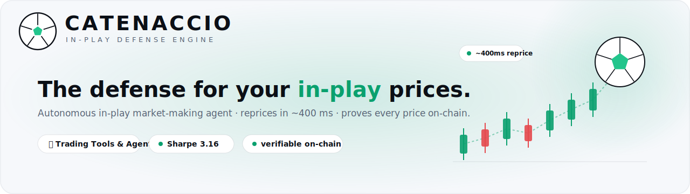
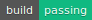
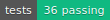
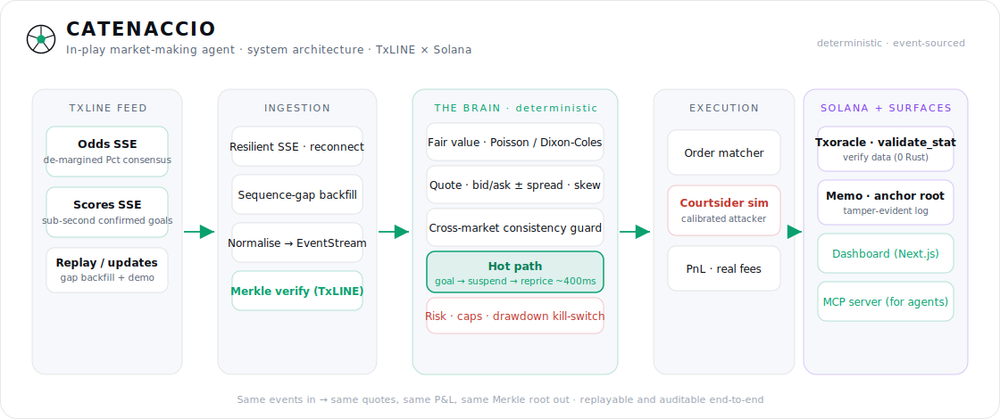
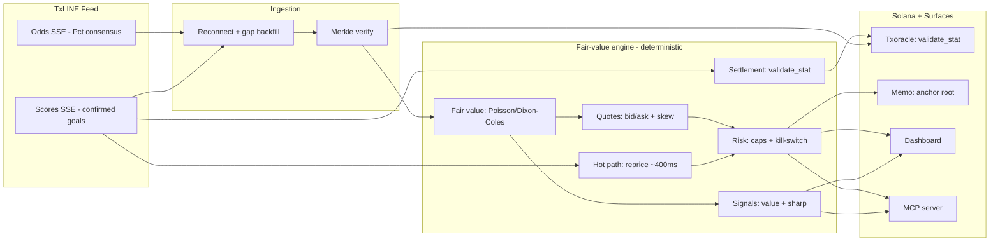
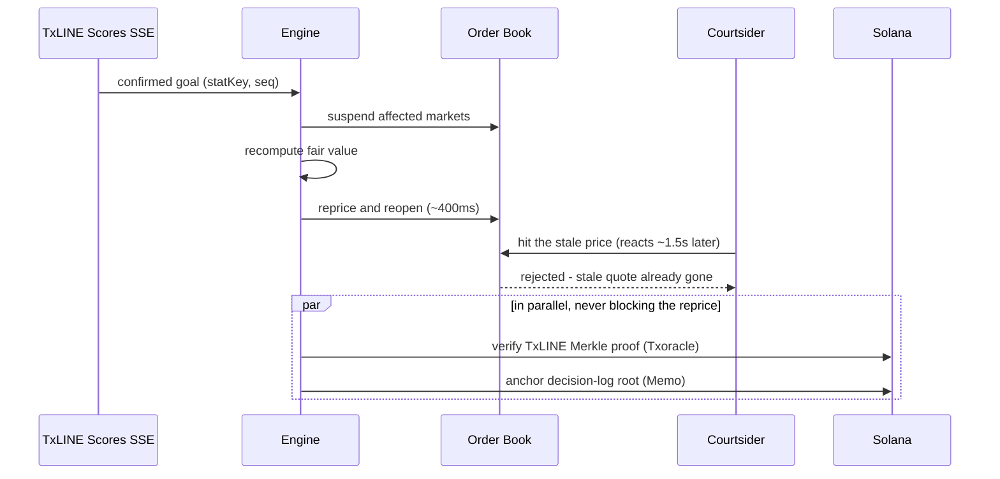

<p align="center">
  
</p>

<h1 align="center">Catenaccio</h1>

<p align="center">
  An autonomous in-play football market-making agent. It ingests TxLINE's live odds
  and scores, reprices in about 400&nbsp;ms when a goal is confirmed so a book is not
  picked off by latency arbitrage, and anchors every price on Solana.
</p>

<p align="center">
  
  
  
  
  
</p>

<p align="center">
  <b>Submitted to: Trading Tools &amp; Agents.</b> TxODDS &times; Solana World Cup Hackathon.
</p>

<p align="center">
  <b>▶ Demo video:</b> <a href="https://youtu.be/_Xxgt5fyRn0">youtu.be/_Xxgt5fyRn0</a>
  &nbsp;·&nbsp;
  <b>Live demo:</b> <a href="https://catenaccio-six.vercel.app">catenaccio-six.vercel.app</a>
</p>

<p align="center">
  <video src="https://catenaccio-six.vercel.app/catenaccio-demo.mp4" controls muted width="80%"></video>
</p>

<p align="center">
  <sub>▶ The full demo plays inline above (turn sound on) &nbsp;·&nbsp; also on <a href="https://youtu.be/_Xxgt5fyRn0"><b>YouTube</b></a></sub>
</p>

---

## What it is, and how it makes money

Catenaccio is an in-play market maker, deployable as a standalone tool. It quotes a
two-sided price on live World Cup markets (match result, over/under 2.5 goals, both teams
to score), reads TxLINE's live odds and scores, and reprices the instant the match state
changes. It is not predicting football. It earns the bid/ask spread, match after match,
and its whole job is to keep doing that without getting picked off.

**Where the income comes from.** Ordinary two-sided flow crosses the spread and the book
banks the margin. That is the steady edge, and it is why the backtest is positive on
average with a Sharpe of 3.16. There is no forecast edge, and none is claimed: fair value
is anchored to TxLINE's own de-margined consensus and only moves when the score or clock
moves.

**The one real enemy: getting picked off.** When a goal goes in, fair value gaps
instantly (an outcome can jump from 3.00 to 1.30), but a slow book keeps showing the old
price for seconds. Whoever saw the goal first, a courtsider at the ground or a latency
arber on a fast feed, takes that stale price for near risk-free profit. In football
in-play this is the dominant way a book bleeds, and today only the largest desks react
fast enough to avoid it.

**The edge is speed, not prediction.** Catenaccio reacts to a cryptographically confirmed
TxLINE goal in about 400&nbsp;ms: it suspends the affected markets, reprices off its model,
and reopens, before a courtsider (about 1.5&nbsp;s) or a broadcast-delayed book (5 to
8&nbsp;s) can act. The stale-price window closes before anyone can trade through it. That
turns the single biggest loss into roughly zero and leaves the spread as clean edge: about
$639 of latency arbitrage prevented per match, 99% of matches profitable in the backtest.

**Why a desk can actually deploy it.** Every quote is anchored to authentic TxLINE data
and provable on Solana, and every position settles against the Merkle-proven final score
through Txoracle `validate_stat`. The P&L is verifiable, not asserted, which is what a real
(and regulated) operator needs before it lets an agent quote its book.

In one line: **autonomous spread income, minus the latency-arb bleed, with pricing anyone
can audit.**

## How the pieces fit, and why each one exists

Everything hangs off **one fair-value engine**. That engine is the spine; every other
part of the system either feeds it authentic data or consumes its output. Nothing here
is a bolt-on, each piece is the answer to a specific problem a real desk has.

| Component | Exists because | What it does |
|---|---|---|
| **Live TxLINE ingestion** | The engine is only as good as its inputs, and a stale or forged input is exactly what gets a book picked off | Streams the odds + scores SSE, reconnects, detects sequence gaps, and backfills before resuming |
| **Fair-value engine** | You cannot quote, signal, or settle without a number you trust | Time-decaying Poisson / Dixon-Coles, calibrated to the de-margined consensus |
| **Quotes** | The core job: make a two-sided market and earn the spread | Bid/ask per outcome with inventory skew and a cross-market consistency guard |
| **~400 ms hot path** | A goal moves the true price seconds before a slow book updates; that gap is where the book loses money | Suspend → reprice → reopen on a confirmed event, before a courtsider can act |
| **Signals** | The same model that prices the book also measures where it disagrees with the market; that disagreement is a tradeable signal | Surfaces model-vs-market value, sharp consensus moves, and live win probability |
| **Risk rails** | An autonomous agent that can blow up is not deployable | Exposure caps, drawdown kill-switch, fees, and suspend-on-gap |
| **Settlement** | A position has to be closed out, and resolving it against the authoritative proof is what makes the P&L credible instead of asserted | Resolves each of the agent's own markets against the Merkle-proven score via Txoracle `validate_stat` |
| **On-chain anchoring + verification** | A track record nobody can audit is worth little | Anchors the decision-log root and lets anyone verify any fill against its TxLINE proof |
| **MCP server** | Other agents should be able to consume these signals | Exposes fair value, quotes, signals, the arb report, and settlement as callable tools |

Read top to bottom it is one loop: **authentic data in → fair value → quote, signal, and
manage risk → settle and prove.**

## The problem it solves

When a goal is scored the fair price changes immediately, but many books take several
seconds to update. In that window, someone who sees the goal first can back the outcome
at the old price for near-risk-free profit. This is latency arbitrage, or courtsiding.
Today only the largest operators react fast enough to avoid it.

Example: a match is 1&ndash;1 and the away side scores in the 84th minute. "Away win"
should shorten from about 3.0 to about 1.3 straight away. A book on a slow feed still
shows 3.0 for a few seconds; a courtsider backs it and profits. Catenaccio suspends and
reprices before that trade can land. Across 500 simulated matches a broadcast-derived
book leaks roughly $640 of this per match; Catenaccio leaks roughly $0.

## How it works

<p align="center">
  
</p>



The model. Remaining goals are modelled as a time-decaying Poisson process with a
Dixon-Coles low-score correction. At kickoff the scoring rates are calibrated to TxLINE's
de-margined consensus (`Pct`), so the agent starts where the market is. After that the
fair value moves only because the score, clock, or cards moved. On a confirmed goal the
model updates instantly while the market consensus lags by its feed latency; the agent
reprices into that lag rather than trying to out-predict anyone.

The hot path, on a confirmed goal:



## Live TxLINE integration (proven on devnet)

TxLINE is the **primary data source**. The agent consumes two SSE streams, odds
(`Pct` de-margined consensus) and scores (sub-second confirmed goals and cards), through
a resilient client that reconnects, detects `seq` gaps, and backfills the missed interval
before it resumes quoting. The engine never quotes on stale data.

This is wired end to end and run against the real feed, not just the bundled replay:

```bash
npm run subscribe   # on-chain: subscribe to the free World Cup tier on devnet + activate an API token
npm run live        # stream the real TxLINE odds + scores feed into the same engine
```

`npm run subscribe` performs TxLINE's actual auth flow from the quickstart: it funds a
devnet wallet, calls Txoracle's `subscribe` instruction (the free World Cup tier moves no
TxL, it just registers the subscription on-chain), gets a guest JWT, signs the activation
message, and writes the activated token to `.env.local`. `npm run live` then streams real
packets. A captured run is in [`docs/live-run.txt`](docs/live-run.txt):

```
[odds] connected
[raw odds #1] {"FixtureId":18172280,"MessageId":"1835583265:00003:000334-10021-stab",
              "Bookmaker":"TXLineStablePriceDemargined","SuperOddsType":"1X2_PARTICIPANTS", ...}
 0' 0-0 | win Home 42% | reprice n/a | feed connected | Sharp move: Away drifting 5.3pp
```

Devnet subscribe transaction:
[`4A66g1kk…RDyk5E`](https://explorer.solana.com/tx/4A66g1kkSMDNnwv6zoW4aZd9NK1Z3tiHcLTJsHkqKyPKx2Kr9HPf2ak5KKwDoismCGUwZSkprBNvEVmvKfRDyk5E?cluster=devnet).
The same deterministic engine runs whether events come from the live socket or the bundled
replay (`npm run agent`), so the demo is reproducible with no credentials.

**Real odds in, measured reprice out.** `npm run capture:real` records a window of real
de-margined consensus ticks to [`data/real-odds-capture.json`](data/real-odds-capture.json);
`npm run replay:real` then runs the engine over them, calibrating fair value off the real
consensus and timing the suspend, reprice, reopen hot path with `performance.now()`. The
free tier carried no live score events on the quiet fixtures in our windows, so the goal
triggers in the replay are labelled synthetic, but the market data and the measured hot path
are real. The engine's own compute is sub-millisecond; the ~400&nbsp;ms headline is the
end-to-end reaction budget a deployed operator sees (event confirmation, network delivery,
and that compute), which is the number a courtsider actually races.

The **deployed dashboard streams it too**: at
[catenaccio-six.vercel.app](https://catenaccio-six.vercel.app), toggle **Replay → Live** and
the page connects to a server-side Edge route (`app/api/stream/route.ts`) that mints a guest
JWT, proxies the real TxLINE odds + scores feed, and forwards normalised events to the browser. The API token never leaves the server. Devnet is the 60-second free tier (real data); true
real-time (0 delay) is the mainnet tier.

## Signals

The fair-value engine does double duty. The number it uses to quote is also a prediction,
and where it diverges from the market is a signal:

- **Value**: outcomes the model rates differently from the de-margined consensus, in
  percentage points (e.g. "Draw underpriced by 4.1pp").
- **Sharp**: fast moves in the consensus itself, tick over tick.
- **Live win probability**: the model's current 1X2 read.

These are the agent's signal-detection output: the thing a human trader or another bot
would act on. They are shown live on the dashboard and exposed over MCP (`get_signals`).

There is also a **standalone signal detector written in Rust** in
[`sharp-detector/`](sharp-detector/): a single compiled binary that streams the odds feed,
flags significant shifts every 60 seconds, and tracks a follow-through hit-rate (did the move
predict continued direction?). It uses Rust because that is the right tool for a lean,
always-on monitor a desk leaves running; it is unit-tested (`cargo test`) and reuses the same
devnet credentials.

## Agent vs Agent Arena

The track's second starter idea is built too. `npm run arena` runs a tournament of seeded
strategy agents over many matches on the same TxLINE-shaped feed and prints a leaderboard
(P&L, ROI, hit-rate, bet count). The agent that reacts fastest to goals wins; a strategy that
fades the move loses. It is the whole thesis staged as a competition: speed, not prediction,
is where the edge is. The final standings digest is anchored on Solana devnet (a real Memo
transaction when a funded devnet wallet is present, simulated otherwise), so who won is
tamper-evident. The tournament is deterministic and unit-tested.

```bash
npm run arena          # 200 matches (default)
npm run arena -- 500   # more matches
```

## Settlement

At full time the agent has to close out its own positions. Rather than grade them itself,
it resolves each market against TxLINE's Merkle-proven final score through Txoracle's
`validate_stat`, which evaluates a parametric predicate against the signed scores and
returns a result, so the settled P&L is verifiable, not asserted. Each market maps to a
concrete predicate:

| Market | Winning-outcome predicate (as `validate_stat` evaluates it) |
|---|---|
| Match result (home) | `homeGoals - awayGoals > 0` |
| Over/Under 2.5 (over) | `homeGoals + awayGoals > 2` |
| Both teams to score (yes) | `homeGoals ≥ 1 AND awayGoals ≥ 1` |

This is the agent settling **its own book** against the authoritative proof, no user
funds, no escrow, no counterparties. It is the last step of the trading loop, made
auditable. (`get_settlement` exposes the same over MCP.)

## On-chain layer, and how much Rust

Everything on-chain is **Solana**, TxLINE is a Solana product (its data is served off-chain
and anchored on Solana via the `Txoracle` program); there is no separate chain. Two things
touch it, and neither needs a custom smart contract:

1. Verifying TxLINE data and resolving outcomes: call TxODDS's deployed `Txoracle`
   `validate_stat` from a TypeScript client. No Rust written by us.
2. Anchoring the decision log: write a 32-byte Merkle root via the SPL Memo program. No Rust.

Both are wired and run for real on devnet (captured in [`docs/onchain-proof.txt`](docs/onchain-proof.txt)):

```bash
npm run anchor   # write the decision-log root via Memo → a real devnet transaction
npm run verify   # call Txoracle.validate_stat on a real TxLINE Merkle proof → true/false
```

For example, a decision-log root anchored in devnet tx
[`5kUp4xP3…547qs`](https://explorer.solana.com/tx/5kUp4xP3DfgVHQRCWxa5mRrkfBDc85zRVA9THfjaaqZgHDwJMgf2MHR3u9vfDefE9havtumEuvatpnQUJXQ547qs?cluster=devnet),
and `validate_stat` returning `true` for a real stat checked against the on-chain daily-scores
root. So the live system is TypeScript end to end. An optional ~50-line Anchor program lives in
[`onchain/`](onchain/) for teams who want a dedicated account instead of memos; nothing requires it.

A proof confirms the data behind a price or settlement is authentic and unaltered. It does
not claim a decision was optimal. The wording throughout is "tamper-evident and
independently verifiable", not "trustless".

## How it maps to the judging criteria

| Criterion | Where it shows up |
|---|---|
| Core functionality and data ingestion | Quotes are decisions off the live/replayed TxLINE odds and scores SSE; reconnect and gap backfill; `npm run live` |
| Autonomous operation | A closed loop with no manual input, ingest, price, quote, manage risk, settle |
| Logic and code architecture | Deterministic, event-sourced, documented, 36 tests; a model calibrated to consensus |
| Innovation and novelty | On-chain-verifiable quotes plus a measured verified-event reprice (~400 ms end-to-end, sub-ms engine compute), with signals exposed over MCP |
| Production readiness | Exposure caps, kill-switch, suspend-on-gap, real fees, a backtest, verifiable settlement, and a working dashboard |

## Tech stack

| Layer | Technology | Purpose |
|---|---|---|
| Agent core | TypeScript, no runtime deps | Deterministic event-sourced engine; runs in the browser and in Node |
| Model | Poisson / Dixon-Coles | In-play fair value, calibrated to TxLINE consensus |
| Web | Next.js 15 (App Router), React 19 | Landing page (animated 3D football pitch) and live dashboard |
| UI | Tailwind CSS, Framer Motion, Three.js (react-three-fiber) | Motion design, the 3D pitch hero, light theme |
| Data | TxLINE SSE (odds + scores) | Live, granular match data |
| On-chain | @solana/web3.js, SPL Memo, TxODDS Txoracle | Verify data, resolve outcomes, anchor the audit trail |
| Crypto | SHA-256 + Merkle tree (in-repo) | Inclusion proofs |
| Interop | Model Context Protocol server | Exposes the agent's signals to other agents |
| Tests | Vitest | Math, determinism, defence logic, settlement |

## Quickstart

Everything runs with no credentials, on a deterministic replay with simulated on-chain
anchoring (the Merkle verification itself is real). To go live, run `npm run subscribe`
once (it provisions a devnet wallet + API token into `.env.local`), then `npm run live`.

```bash
npm install
npm run dev        # landing page at :3000; "Launch app" opens the dashboard at /app
npm run agent      # headless run of the same engine (deterministic replay)
npm run subscribe  # one-time: subscribe to the free World Cup tier on devnet + activate a token
npm run live       # stream the real TxLINE odds + scores feed into the engine
npm run capture:real  # record real TxLINE odds ticks to data/real-odds-capture.json
npm run replay:real   # replay those real odds through the engine, with a measured reprice
npm run anchor     # anchor a decision-log root on devnet (real Memo tx)
npm run verify     # verify a real TxLINE stat on devnet via Txoracle.validate_stat
npm run backtest   # 500 simulated matches
npm run sweep      # latency-arb sensitivity curve
npm run arena      # Agent vs Agent Arena tournament (standings anchored on devnet)
npm run mcp        # MCP server over stdio
npm test           # 36 tests
```

Backtest over 500 simulated matches (reproduce with `npm run backtest`):

```
mean P&L / match      $2,629        profitable matches    99%
Sharpe (per match)    3.16          worst / best match    -$1,132 / $4,233
mean commission/match $668          mean arb prevented    $639 / match
reprice (end-to-end)  ~410 ms       engine hot path       sub-ms (measured)
```

A market maker can lose on any single match; the value is the mean over many, plus the
latency-arb it avoids. There is no claim of guaranteed profit.

## MCP tools

The server exposes the agent over stdio so another agent can call it:
`get_fair_value`, `get_quote`, `get_signals`, `get_arb_report`, `verify_decision`,
`run_backtest`, `get_settlement`.

## Tests

```bash
npm test
```

| Suite | Covers |
|---|---|
| `crypto` | SHA-256 against NIST vectors; Merkle proofs verify; tampering is detected |
| `model` | Calibration to consensus; a goal raises P(win); draw rises with time; red-card effect |
| `courtsiding` | Leak is zero when the reprice beats the attacker; a slow defender leaks |
| `engine` | Determinism (same seed → same Merkle root and P&L); reprice fires; measured hot path stays out of the hashed log; bounded exposure; clean settlement |
| `settlement` | Predicate mapping per outcome; correct winners; receipts reference Txoracle and the proof; signals fire and stay quiet when model and market agree |

## Devnet addresses

| Program / token | Address |
|---|---|
| TxODDS Txoracle (verify + resolve) | [`6pW64gN1s2uqjHkn1unFeEjAwJkPGHoppGvS715wyP2J`](https://explorer.solana.com/address/6pW64gN1s2uqjHkn1unFeEjAwJkPGHoppGvS715wyP2J?cluster=devnet) |
| SPL Memo (decision-log anchoring) | [`MemoSq4gqABAXKb96qnH8TysNcWxMyWCqXgDLGmfcHr`](https://explorer.solana.com/address/MemoSq4gqABAXKb96qnH8TysNcWxMyWCqXgDLGmfcHr?cluster=devnet) |
| TxL mint (devnet) | [`4Zao8ocPhmMgq7PdsYWyxvqySMGx7xb9cMftPMkEokRG`](https://explorer.solana.com/address/4Zao8ocPhmMgq7PdsYWyxvqySMGx7xb9cMftPMkEokRG?cluster=devnet) |

## TxLINE endpoints used

| Endpoint | Used for |
|---|---|
| `POST /auth/guest/start` | guest JWT |
| `POST /api/token/activate` | activate the API token after an on-chain subscription |
| `GET /api/odds/stream` | de-margined consensus (`Pct`), the fair-value anchor |
| `GET /api/scores/stream` | sub-second confirmed goals and cards |
| `GET /api/{odds,scores}/updates/{day}/{hour}/{interval}` | replay and sequence-gap backfill |
| `GET /api/scores/stat-validation` | a stat and its Merkle proof |
| `Txoracle` `validate_stat` | confirm a stat / resolve an outcome against the on-chain root |

## API feedback

What worked: one normalised JSON schema across markets, real-time SSE for both odds and
scores, and a de-margined `Pct` consensus that is a good fair-value anchor. That every
datum is Merkle-verifiable on-chain made both the audit trail and settlement
straightforward, `validate_stat` maps cleanly onto market outcomes.

Friction: the docs resolve on `txline-docs.txodds.com`, which differs from the link in the
listing; the devnet base URL could be called out more clearly; and a documented SSE
reconnect and sequence-gap contract would save integrators from reimplementing it. On the
free dev tier the `scores/updates` windows came back empty for quiet fixtures, so a live
goal was not always available to record; a sandbox fixture that emits in-running score
events on demand would make real-data testing much easier (it is why `npm run replay:real`
drives its reprices with labelled synthetic goals over real captured odds).

## Project structure

```
lib/engine/     deterministic agent (pure TypeScript)
  math/         SHA-256, in-play model
  merkle.ts     Merkle tree and inclusion proofs
  quote.ts      two-sided quoting + cross-market consistency guard
  signals.ts    value + sharp prediction signals
  risk.ts       exposure caps, kill-switch, fees
  courtsiding.ts  the calibrated latency-arb attacker
  engine.ts     event-sourced orchestrator
  replay.ts     scripted demo match; simulate.ts generates random matches
lib/txline/     auth, resilient SSE client, payload normaliser
lib/onchain/    Memo anchoring (solana.ts) and validate_stat settlement (settlement.ts)
components/     dashboard, landing page, illustration, logo
mcp/            MCP server
scripts/        agent, subscribe (devnet auth flow), live, anchor, verify, backtest, sweep
tests/          Vitest suites
onchain/        optional Anchor program and notes
sharp-detector/ standalone Sharp Movement Detector (Rust binary, unit-tested)
```

## Limitations

- Single-match P&L varies; a market maker sometimes lays the eventual winner. The mean
  over many matches is positive (see the backtest). No guaranteed profit.
- There is no real counterparty in a hackathon, so order flow and the courtsider are
  simulated. The attacker is calibrated and the result is a sensitivity curve rather than
  a single figure.
- A Merkle proof guarantees data authenticity, not decision quality. Settlement here
  resolves the agent's own positions; it is not a user-facing escrow.
